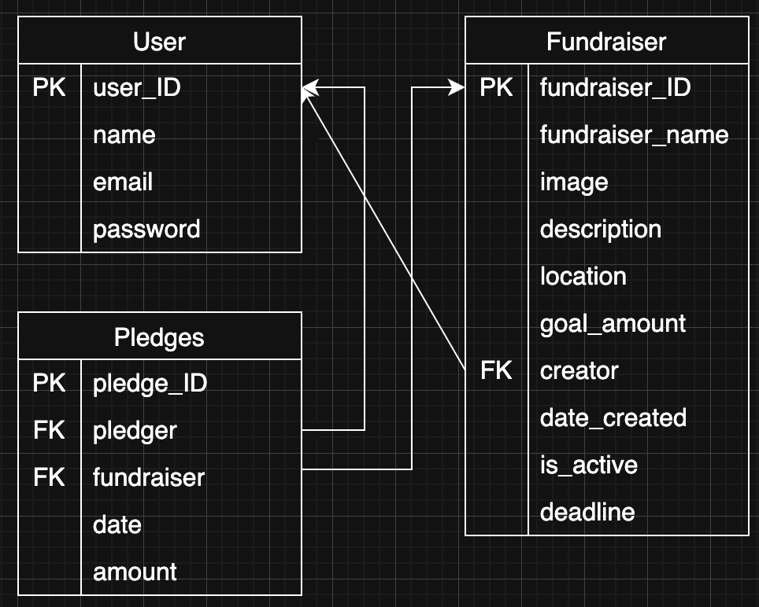

# crowdfunding_back_end

A repo to contain my She Codes Crowdfunding back end project

# Crowdfunding Back End

Selina Shin

## Planning:

### Concept/Name

'Community Change' is a community-driven crowdfunding platform that allows people to create fundraisers for small, local improvement projects in their neighbourhood. Instead of waiting for council action, residents can raise money to directly support initiatives.

### Intended Audience/User Stories

The intended audience for Community Change includes:
- Local residents who want to improve their suburb or neighbourhood but lack the time, resources, or influence to navigate council processes
- Community groups and volunteers looking to fund small-scale local projects (e.g. murals, youth programs, library resources)
- Neighbourhood organisers who want a simple way to propose ideas, raise funds, and track community support

User stories:
- "As a community member, I want to view all fundraisers" -> Endpoint: GET/fundraisers/
- "As a fundraiser creator, I want to create a fundraiser" -> Endpoint: POST/fundraisers/
- "As a community member, I want to view fundraiser details" -> Endpoint: GET/fundraisers/<id>/

### Front End Pages/Functionality

- Home Page
  - Overview of the platform and how it works
  - Featured or recent local fundraisers
- Sign Up / Log In Page
  - Register as a community member
  - Log in to existing account
- User Dashboard
  - Create and edit local fundraisers
  - View fundraisers you have created
  - Track funding received on your projects
  - View contributions you have made to other fundraisers
- Browse Fundraisers Page
  - Browse active fundraisers
  - Filter by suburb/council
  - View funding progress for each fundraiser
- Fundraiser Page
  - Display fundraiser description, location, and goal
  - Show funding progress and deadline
  - Allow users to contribute funds
  - View updates from the fundraiser creator

### API Spec

| URL | HTTP Method | Purpose | Request Body | Success Response Code | Authentication/Authorisation |
| /api/signup | POST | Create new account | name, email, password, role | 201 Created | none |
| /api/login | POST | Log a user into the system | email, password | 200 OK | none |
| /api/dashboard | GET | Retrieve dashboard | none | 200 OK | authenticated user |
| /api/fundraisers | POST | Create new fundraiser | title, description, category| 201 Created | authenticated user |
| /api/fundraisers | GET | View all fundraisers | none | 200 OK | authenticated user |
| /api/fundraisers/{id}/pledge| POST | Pledge fundraiser | amount | 200 OK | authenticated user |

### DB Schema

